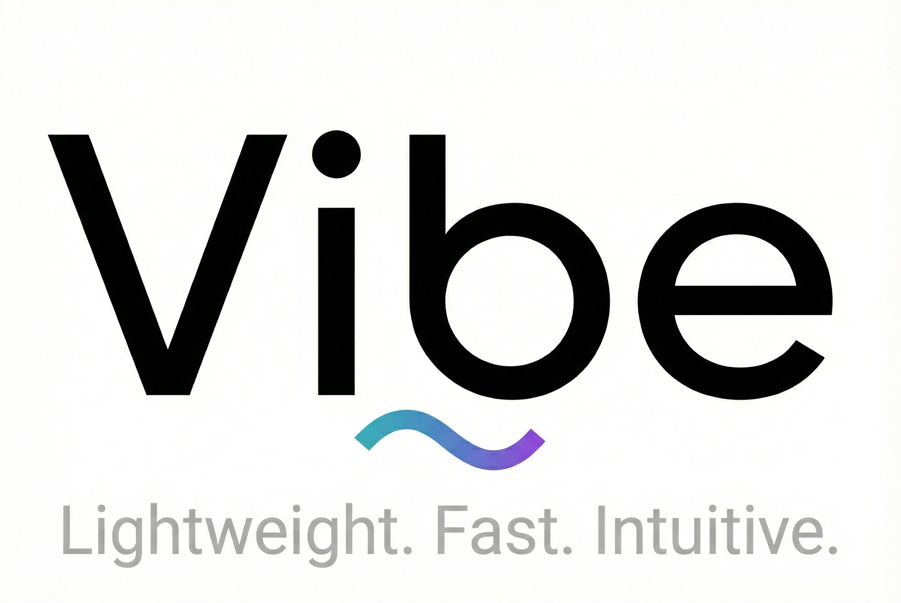

<div align="center">
  
  <h1>Vibe</h1>
  <p>
    <b>A lightweight, high-performance Node.js web framework built for speed and scalability.</b>
  </p>
</div>

---

Vibe (part of the **GeNeSix** ecosystem) is a zero-dependency\* web framework with **Radix Trie routing**, **cluster mode**, **response caching**, and a **Fastify-style plugin system**.

> **Dependency Note:** The only dependency is `busboy` for multipart file parsing.

## ⚡ Features

| Feature                  | Description                                   |
| :----------------------- | :-------------------------------------------- |
| 🚀 **Radix Trie Router** | O(log n) route matching with hybrid mode      |
| 🔌 **Plugin System**     | Fastify-style `register()` with encapsulation |
| 🎨 **Decorators**        | Extend app, request, and response             |
| ⚡ **Cluster Mode**      | Multi-process scaling                         |
| 💾 **Response Caching**  | LRU cache with ETag support                   |
| 🔗 **Connection Pool**   | Generic pool for database connections         |
| 📂 **Streaming**         | Stream large files without buffering          |

## 🚀 Quick Start

```javascript
import vibe from "./vibe.js";

const app = vibe();

app.get("/", "Hello Vibe!");
app.get("/users/:id", (req, res) => ({ userId: req.params.id }));

app.listen(3000);
```

## 📖 Core API

### Routes

```javascript
app.get("/path", handler);
app.post("/path", { intercept: authMiddleware }, handler);
app.del("/path", handler); // DELETE
```

### Plugins (Fastify-style)

```javascript
app.register(
  async (app) => {
    app.get("/status", { status: "ok" });
  },
  { prefix: "/api" },
);
```

### Decorators

```javascript
app.decorate("config", { env: "prod" });
app.decorateRequest("user", null);
app.decorateReply("sendSuccess", function (d) {
  this.success(d);
});
```

---

## 🔥 Scalability Features

### Cluster Mode

```javascript
import vibe, { clusterize } from "./vibe.js";

clusterize(
  () => {
    const app = vibe();
    app.get("/", "Hello from worker!");
    app.listen(3000);
  },
  { workers: 4, restart: true },
);
```

### Response Caching

```javascript
import vibe, { LRUCache, cacheMiddleware } from "./vibe.js";

const app = vibe();
const cache = new LRUCache({ max: 1000, ttl: 60000 });

app.get("/data", { intercept: cacheMiddleware(cache) }, () => {
  return { expensive: "computation" };
});
```

### Connection Pool

```javascript
import vibe, { createPool } from "./vibe.js";

const dbPool = createPool({
  create: async () => new DBConnection(),
  destroy: async (conn) => conn.close(),
  max: 10,
});

app.decorate("db", dbPool);

app.get("/users", async (req, res) => {
  return await app.decorators.db.use(async (conn) => {
    return conn.query("SELECT * FROM users");
  });
});
```

### Streaming Uploads

```javascript
app.post("/upload", { media: { streaming: true } }, (req, res) => {
  req.on("file", (name, stream, info) => {
    stream.pipe(fs.createWriteStream(`/uploads/${info.filename}`));
  });
  return { status: "uploading" };
});
```

---

## 🛠️ API Reference

### Application

| Method                    | Description       |
| :------------------------ | :---------------- |
| `app.listen(port)`        | Start server      |
| `app.register(fn, opts)`  | Register plugin   |
| `app.decorate(name, val)` | Add app property  |
| `app.plugin(fn)`          | Global middleware |

### Request (`req`)

| Property     | Description      |
| :----------- | :--------------- |
| `req.params` | Route parameters |
| `req.query`  | Query strings    |
| `req.body`   | Parsed body      |
| `req.files`  | Uploaded files   |

### Response (`res`)

| Method              | Description   |
| :------------------ | :------------ |
| `res.json(data)`    | Send JSON     |
| `res.send(data)`    | Send response |
| `res.status(code)`  | Set status    |
| `res.success(data)` | 200 OK        |
| `res.notFound()`    | 404           |

---

## 📝 License

Part of the **GeNeSix** brand. Created by **Nnamdi "Joe" Amaga**. MIT License.
