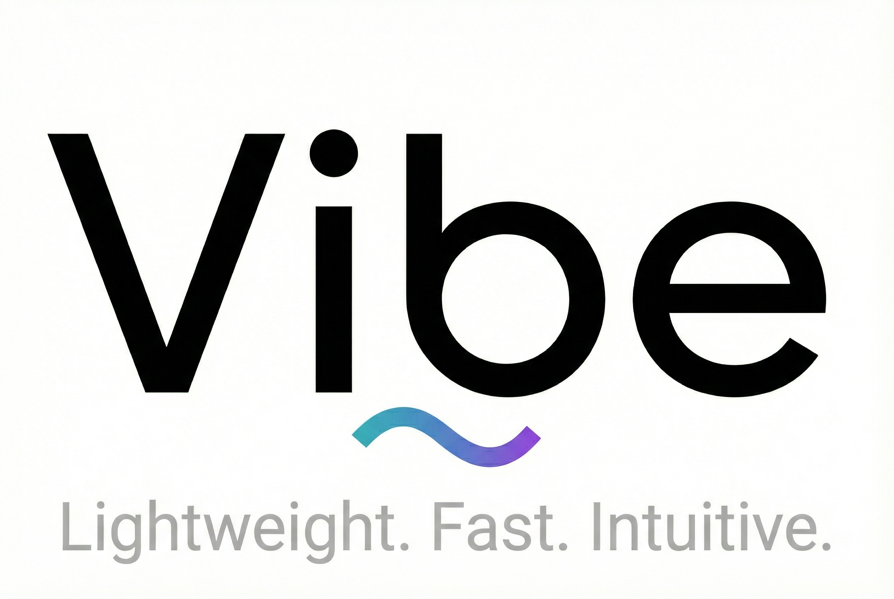

<div align="center">
  
  <h1>Vibe</h1>
  <p>
    <b>The fastest Node.js web framework with the simplest syntax.</b>
  </p>
  <p>
    
    
    
    
  </p>
</div>

---

## 📦 Installation

```bash
npm install vibe-gx
```

> Pure JavaScript — no native dependencies, no build steps, just install and go.

---

## 🏆 Why Vibe?

| Metric                     |      Vibe      |  Express  |  Fastify   |
| :------------------------- | :------------: | :-------: | :--------: |
| **JSON Performance**       | **11,472 RPS** | 2,421 RPS | 11,334 RPS |
| **Install Size**           |  **~280 KB**   |   ~5 MB   |   ~4 MB    |
| **Lines for Hello World**  |       3        |     5     |     6      |
| **Dependencies**           |       1        |    30+    |    15+     |
| **Built-in Clustering**    |       ✅       |    ❌     |     ❌     |
| **Built-in Caching**       |       ✅       |    ❌     |     ❌     |
| **Code-Gen Serialization** |       ✅       |    ❌     |     ✅     |

> **Vibe is faster than Fastify, simpler than Express, and 14-18x smaller than both.**

---

## ⚡ Features

| Feature                       | Description                                                |
| :---------------------------- | :--------------------------------------------------------- |
| 🚀 **Code-Gen Serialization** | Schema-compiled JSON serializers via `new Function()`      |
| 🎯 **Hybrid Router**          | O(1) static + O(log n) Trie routing                        |
| 🔌 **Plugin System**          | Fastify-style `register()` with encapsulation              |
| 🎨 **Decorators**             | Extend app, request, and response                          |
| ⚡ **Cluster Mode**           | Built-in multi-process scaling                             |
| 💾 **LRU Cache**              | Built-in response caching with ETag                        |
| 🔗 **Connection Pool**        | Generic pool for databases                                 |
| 📂 **File Uploads**           | Multipart uploads with size/type validation                |
| 🌊 **Streaming**              | Large file uploads without buffering                       |
| 🔒 **Security**               | Path traversal protection, body limits, error sanitization |
| 🔄 **Express Adapter**        | Use any Express middleware with `adapt()`                  |

---

## 🚀 Quick Start

```javascript
import vibe from "vibe-gx";

const app = vibe();

// Direct value - no callback needed!
app.get("/", "Hello Vibe!");

// Auto JSON response - just return an object
app.get("/users/:id", (req) => ({ userId: req.params.id }));

app.listen(3000);
```

**That's it.** No `res.send()`, no `res.json()` - just return data.

---

## 📖 Core API

### Routes

Vibe supports all standard HTTP methods with a clean, flexible syntax:

```javascript
// String response
app.get("/", "Hello World");

// JSON response (just return an object)
app.get("/json", { message: "Hello" });

// Handler function with request access
app.get("/users/:id", (req) => ({ id: req.params.id }));

// Multiple route parameters
app.get("/posts/:postId/comments/:commentId", (req) => ({
  postId: req.params.postId,
  commentId: req.params.commentId,
}));

// With options (interceptors, file uploads)
app.post("/protected", { intercept: authCheck }, handler);

// All HTTP methods
app.get("/");
app.post("/");
app.put("/");
app.del("/"); // DELETE
app.patch("/");
app.head("/");
```

### Query Parameters

```javascript
// GET /search?q=hello&page=2
app.get("/search", (req) => ({
  query: req.query.q, // "hello"
  page: req.query.page, // "2"
}));
```

### Request Body

```javascript
app.post("/users", (req) => {
  const { name, email } = req.body;
  return { created: { name, email } };
});
```

---

## 🔌 Plugins (Fastify-style)

Plugins provide encapsulated route groups with optional prefixes:

```javascript
// Register a plugin with prefix
await app.register(
  async (api) => {
    api.get("/status", { status: "ok" }); // GET /api/status
    api.get("/health", { healthy: true }); // GET /api/health

    // Plugins can have their own interceptors
    api.plugin((req, res) => {
      console.log(`[API] ${req.method} ${req.url}`);
    });
  },
  { prefix: "/api" },
);

// Nested plugins
await app.register(
  async (v1) => {
    v1.get("/users", { version: 1 }); // GET /api/v1/users
  },
  { prefix: "/api/v1" },
);
```

---

## 🛡️ Interceptors (Middleware)

Interceptors run before your handler. Return `false` to stop execution.

### Single Interceptor

```javascript
const authCheck = (req, res) => {
  if (!req.headers.authorization) {
    res.unauthorized("Token required");
    return false; // Stop execution
  }
  req.user = { id: 1 };
  return true; // Continue to handler
};

app.get("/protected", { intercept: authCheck }, (req) => {
  return { user: req.user };
});
```

### Multiple Interceptors

```javascript
app.get(
  "/admin",
  {
    intercept: [authCheck, adminCheck, rateLimiter],
  },
  handler,
);
```

### Global Interceptors

```javascript
// Applies to ALL routes
app.plugin((req, res) => {
  console.log(`${req.method} ${req.url}`);
});
```

---

## 🎨 Decorators

Extend app, request, or response with custom properties:

```javascript
// App decorator - shared config
app.decorate("config", { env: "production", version: "1.0.0" });

// Access via app.decorators in main app
app.get("/version", () => ({ version: app.decorators.config.version }));

// In plugins, decorators are spread directly (no .decorators)
app.register(
  async (api) => {
    api.get("/env", () => ({ env: api.config.env })); // Direct access
  },
  { prefix: "/api" },
);

// Request decorator - add to all requests
app.decorateRequest("timestamp", () => Date.now());

app.get("/time", (req) => ({ timestamp: req.timestamp }));

// Reply decorator - add methods to response
app.decorateReply("sendSuccess", function (data) {
  this.success(data);
});
```

---

## 📂 File Uploads

Vibe supports multipart file uploads with built-in validation and security.

> **🔒 Security**: File uploads are **disabled by default**. You must explicitly configure `media` options to accept uploads.

### Basic Upload

```javascript
app.post("/upload", { media: { dest: "uploads" } }, (req) => {
  return { files: req.files, body: req.body };
});
```

### Media Options

```javascript
app.post(
  "/upload",
  {
    media: {
      dest: "uploads", // Subfolder destination
      public: true, // Save in public folder (default: true)
      maxSize: 5 * 1024 * 1024, // Max file size: 5MB
      allowedTypes: ["image/jpeg", "image/png", "image/*"], // Wildcards supported
    },
  },
  handler,
);
```

### Public vs Private Uploads

**Public uploads** (web-accessible):

```javascript
app.post(
  "/upload/avatar",
  {
    media: {
      public: true, // ✅ Files accessible via HTTP
      dest: "avatars", // Saved to: public/avatars/
    },
  },
  handler,
);

// Files accessible at: http://yourapp.com/avatars/filename.jpg
```

**Private uploads** (server-only access):

```javascript
app.post(
  "/upload/documents",
  {
    media: {
      public: false, // 🔒 Files NOT web-accessible
      dest: "documents", // Saved to: private/documents/
    },
  },
  handler,
);

// Files only accessible via your backend code (e.g., sendAbsoluteFile)
```

### Uploaded File Object

```javascript
// req.files contains:
[
  {
    filename: "image-a7x92b.png", // Saved filename (safe)
    originalName: "photo.png", // Original filename
    type: "image/png", // MIME type
    filePath: "/uploads/image-a7x92b.png", // Full path
    size: 102400, // Size in bytes
  },
];
```

### Streaming Uploads (Large Files)

For large files, use streaming mode to avoid buffering in memory:

```javascript
import fs from "fs";

app.post("/upload-large", { media: { streaming: true } }, (req) => {
  req.on("file", (name, stream, info) => {
    stream.pipe(fs.createWriteStream(`/uploads/${info.filename}`));
  });
  return { status: "uploading" };
});
```

### Error Handling

- **413 Payload Too Large** - File exceeds `maxSize`
- **415 Unsupported Media Type** - File type not in `allowedTypes`

---

## 🔥 Scalability

### Cluster Mode

Scale across all CPU cores automatically:

```javascript
import vibe, { clusterize, isPrimary, getWorkerId } from "vibe-gx";

clusterize(
  () => {
    const app = vibe();
    app.get("/", `Hello from worker ${getWorkerId()}!`);
    app.listen(3000);
  },
  {
    workers: 4, // Number of workers (default: CPU count)
    restart: true, // Auto-restart crashed workers
    restartDelay: 1000, // Delay before restart (ms)
  },
);
```

### LRU Cache

Built-in response caching with ETag support:

```javascript
import vibe, { LRUCache, cacheMiddleware } from "vibe-gx";

const cache = new LRUCache({
  max: 1000, // Maximum entries
  ttl: 60000, // TTL in milliseconds (60 seconds)
});

app.get("/expensive", { intercept: cacheMiddleware(cache) }, async () => {
  // This only runs on cache MISS
  return await expensiveOperation();
});

// Manual cache operations
cache.set("key", { data: "value" });
cache.get("key"); // { value, expires, etag }
cache.delete("key");
cache.clear();
```

### Connection Pool

Generic connection pool for databases:

```javascript
import vibe, { createPool } from "vibe-gx";

const dbPool = createPool({
  create: async () => await connectToDatabase(),
  destroy: async (conn) => await conn.close(),
  validate: (conn) => conn.isAlive(),
  min: 2, // Minimum connections
  max: 10, // Maximum connections
  acquireTimeout: 30000, // Timeout to acquire (ms)
  idleTimeout: 60000, // Idle timeout (ms)
});

app.get("/users", async () => {
  return await dbPool.use(async (conn) => {
    return await conn.query("SELECT * FROM users");
  });
});

// Pool statistics
console.log(dbPool.stats);
// { available: 5, inUse: 2, waiting: 0, max: 10 }

// Cleanup on shutdown
process.on("SIGTERM", () => dbPool.close());
```

---

## 🔄 Express Middleware Adapter

Use any Express middleware with the adapter:

```javascript
import { adapt } from "vibe-gx/utils/helpers/adapt.js";
import cors from "cors";
import helmet from "helmet";
import compression from "compression";

app.plugin(adapt(cors()));
app.plugin(adapt(helmet()));
app.plugin(adapt(compression()));
```

---

## 🔒 Security

Built-in protections:

| Feature                                  | Status |
| :--------------------------------------- | :----: |
| **File upload protection** (opt-in only) |   ✅   |
| Path traversal protection                |   ✅   |
| File type validation                     |   ✅   |
| Body size limits (1MB JSON, 10MB files)  |   ✅   |
| Error sanitization (production mode)     |   ✅   |
| Safe filename generation                 |   ✅   |
| Port validation                          |   ✅   |

### File Upload Security

Routes **reject multipart uploads by default** unless `media` is explicitly configured:

```javascript
// ❌ This will reject file uploads with 400 Bad Request
app.post("/api/data", (req) => ({ data: req.body }));

// ✅ This accepts file uploads (explicit opt-in)
app.post(
  "/upload",
  {
    media: {
      dest: "uploads",
      maxSize: 5 * 1024 * 1024,
      allowedTypes: ["image/*", "application/pdf"],
    },
  },
  handler,
);
```

This prevents attackers from uploading malicious files to unintended routes.

Set `NODE_ENV=production` for secure error handling (stack traces hidden).

---

## ⚡ Schema-Based Serialization

**Optional** performance boost: Pre-compile JSON serializers for 2-3x faster responses.

```javascript
app.get(
  "/users/:id",
  {
    schema: {
      response: {
        type: "object",
        properties: {
          id: { type: "number" },
          name: { type: "string" },
          email: { type: "string" },
          active: { type: "boolean" },
        },
      },
    },
  },
  async (req) => {
    const user = await db.getUser(req.params.id);
    return user; // Uses pre-compiled serializer (2-3x faster than JSON.stringify)
  },
);
```

**Benefits:**

- ✅ 2-3x faster JSON serialization
- ✅ Zero-loop code generation via `new Function()`
- ✅ No `Object.keys()` enumeration
- ✅ Zero runtime type checking
- ✅ Completely optional (routes work without schemas)

---

### Route Options

```javascript
app.post(
  "/path",
  {
    intercept: authMiddleware, // Middleware function(s)
    media: {
      // File upload config
      dest: "uploads",
      maxSize: 10 * 1024 * 1024,
      allowedTypes: ["image/*"],
    },
  },
  handler,
);
```

## 🛠️ API Reference

### Application

| Method                                           | Description          |
| :----------------------------------------------- | :------------------- |
| `app.get/post/put/del/patch/head(path, handler)` | Register route       |
| `app.listen(port, host?, callback?)`             | Start server         |
| `app.register(fn, { prefix })`                   | Register plugin      |
| `app.plugin(fn)`                                 | Global interceptor   |
| `app.decorate(name, value)`                      | Add app property     |
| `app.decorateRequest(name, value)`               | Add to all requests  |
| `app.decorateReply(name, value)`                 | Add to all responses |
| `app.setPublicFolder(path)`                      | Set static folder    |
| `app.logRoutes()`                                | Log all routes       |

### Request (`req`)

| Property      | Description                |
| :------------ | :------------------------- |
| `req.params`  | Route parameters (`:id`)   |
| `req.query`   | Query string (`?page=1`)   |
| `req.body`    | Parsed JSON/form body      |
| `req.files`   | Uploaded files (multipart) |
| `req.ip`      | Client IP address          |
| `req.method`  | HTTP method                |
| `req.url`     | Request URL                |
| `req.headers` | Request headers            |

### Response (`res`)

| Method                              | Description                  |
| :---------------------------------- | :--------------------------- |
| `res.json(data)`                    | Send JSON                    |
| `res.send(data)`                    | Send any response            |
| `res.status(code)`                  | Set status (chainable)       |
| `res.redirect(url, code?)`          | Redirect (302)               |
| `res.sendFile(path)`                | Send file from public folder |
| `res.sendAbsoluteFile(path, opts?)` | Send file from any path      |
| `res.sendHtml(filename)`            | Send HTML file               |
| `res.success(data?, msg?)`          | 200 OK                       |
| `res.created(data?, msg?)`          | 201 Created                  |
| `res.badRequest(msg?, errors?)`     | 400 Bad Request              |
| `res.unauthorized(msg?)`            | 401 Unauthorized             |
| `res.forbidden(msg?)`               | 403 Forbidden                |
| `res.notFound(msg?)`                | 404 Not Found                |
| `res.conflict(msg?)`                | 409 Conflict                 |
| `res.serverError(err?)`             | 500 Server Error             |

### Cluster Utilities

| Function               | Description                   |
| :--------------------- | :---------------------------- |
| `clusterize(fn, opts)` | Start in cluster mode         |
| `isPrimary()`          | Check if primary process      |
| `isWorker()`           | Check if worker process       |
| `getWorkerId()`        | Get worker ID (0 for primary) |
| `getWorkerCount()`     | Get number of active workers  |

### Cache Utilities

| Class/Function              | Description               |
| :-------------------------- | :------------------------ |
| `new LRUCache(opts)`        | Create LRU cache instance |
| `cacheMiddleware(cache)`    | Create cache interceptor  |
| `LRUCache.key(method, url)` | Generate cache key        |
| `LRUCache.etag(value)`      | Generate ETag             |

### Pool Utilities

| Class/Function     | Description            |
| :----------------- | :--------------------- |
| `createPool(opts)` | Create connection pool |
| `pool.acquire()`   | Acquire resource       |
| `pool.release(r)`  | Release resource       |
| `pool.use(fn)`     | Use with auto-release  |
| `pool.close()`     | Close pool             |
| `pool.stats`       | Get pool statistics    |

---

## 📊 Benchmarks

Run benchmarks yourself:

```bash
npm run benchmark
```

Tested under overload (20,000 requests × 200 concurrent):

```
Framework    | JSON RPS    | vs Express | vs Fastify
-------------|-------------|------------|------------
Vibe         | 11,472      | 4.7x ✅    | 1.01x ✅
Fastify      | 11,334      | 4.7x       | baseline
Hono         | 7,351       | 3.0x       | 0.6x
Express      | 2,421       | baseline   | 0.2x
```

---

## 🧪 Testing

```bash
# Run all tests
npm test

# Run comprehensive tests
npm run test:all

# Run benchmarks
npm run benchmark
```

---

## 📝 License

Part of the **GeNeSix** brand. Created by **Nnamdi "Joe" Amaga**.

MIT License.
